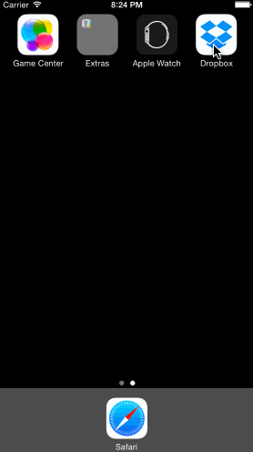

##Week 1 Homework - Dropbox Prototype

### Time Spent
9 hours

#### Required Stories Completed (All)
* Welcome screens
* Create account flow
* Sign in flow

#### Optional Stories (All)
* File detail view, favoriting the file updates both files and favorites tabs
* Text files for create account and sign in forms
* Swipe through welcome screens

#### Additional story
* Added prepareSegue() in the welcome screen so the signup/signin screen only gets skipped from that view
* Fake password strength indicators, "Create" is only enabled when the strength is above "So-So" and "Sign In" is only enabled when both email and password fields are filled

GIF created with [LICEcap](http://licecap.en.softonic.com/ "Download LICEcap").
